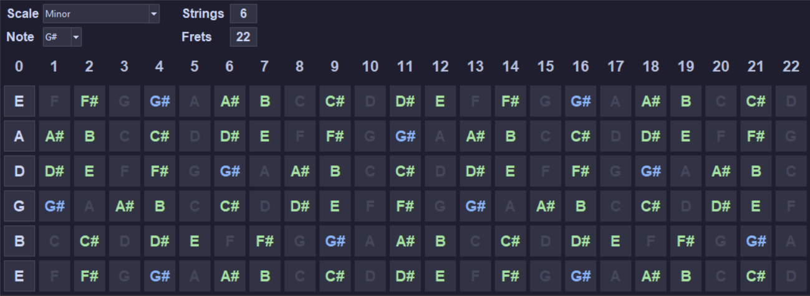
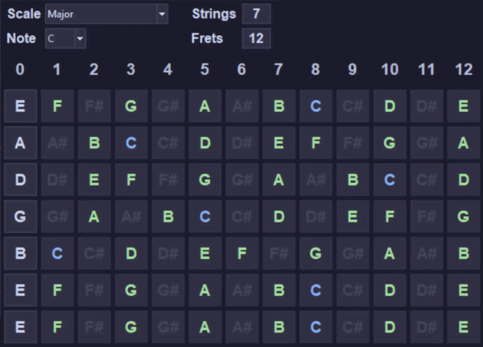

# Fretboard Scale Finder

A lightweight Python GUI tool to visualize musical scales on a guitar (or any string instrument) fretboard. 

I needed something like this, if it could be useful to you - be my guest

# Demonstration


# What it does
* **Dynamic Visualization:** Pick a root note and a scale (Major/Minor), and the app maps out all the notes across the fretboard.
* **Custom Instruments:** You're not limited to a standard 6-string guitar. You can change the number of strings and frets on the fly.
* **Custom Tuning:** Click on any open string note on the left to change its tuning.

# Executing

Requires ```python``` **(version 3.x)** to run
```
python fretboard-scale-finder.py
```
